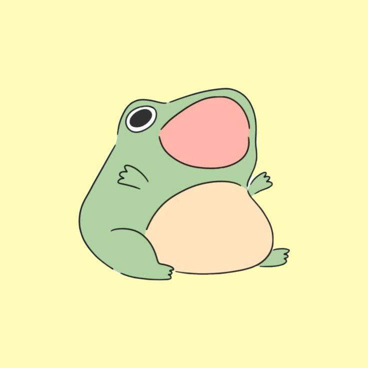

# Mail 2 Discord
## Setup Instructions<br>
Before running the project, you need to set up the Gmail and Discord APIs and generate tokens for them.<br>
1. **Discord Token**: Place the Discord token in the `param.json` file.
2. **Gmail Token**: Place the Gmail token.pickle in the `/token` folder.<br>
    If you run the without it, a Google prompt will help you get it.
3. **Discord ID** : Provide your discord ID in the `param.json` file<br>
Then place the 'param.json' file in the `/token` folder.<br>

<details>
  <summary>Clic here for gmail setup details</summary>
<h1><strong>to be added</strong></h1>
<div style="text-align:center">
  
</div>

</details>

<details>
  <summary>Clic here for discord setup details</summary>

1. Go visit the [Discord Developer Applications](https://discord.com/developers/applications) page
2. create a new Application
3. under `Bot` click the `Reset Token` button and copy the api key
4. past it in `param.json` as your `discordtoken`
</details>


## Running the Project<br>
To run the project, use the following command:<br>
```bash
python3 main.py
```

## Runing in Docker

You will need to run the main.py once outside of docker to generate the pickle tocken then run :

```bash
sudo docker build -t mailtodiscord .
```
and once completed
```bash
./mailtodiscord.sh
```